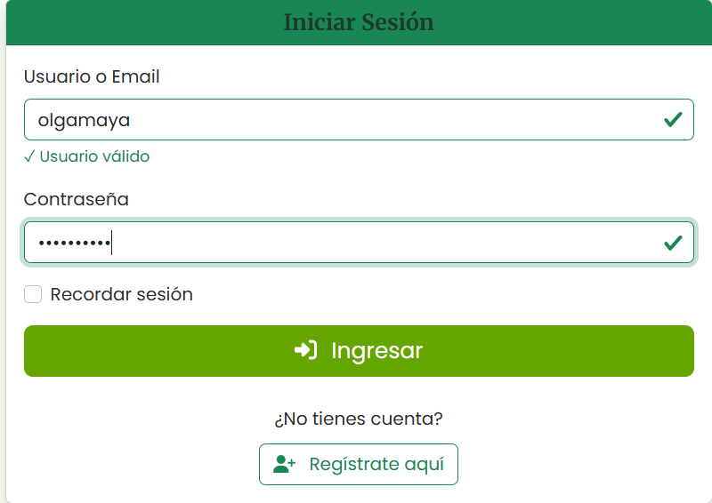
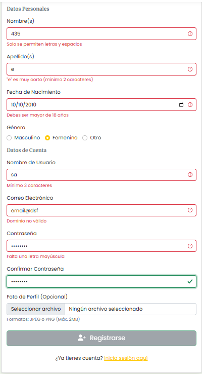
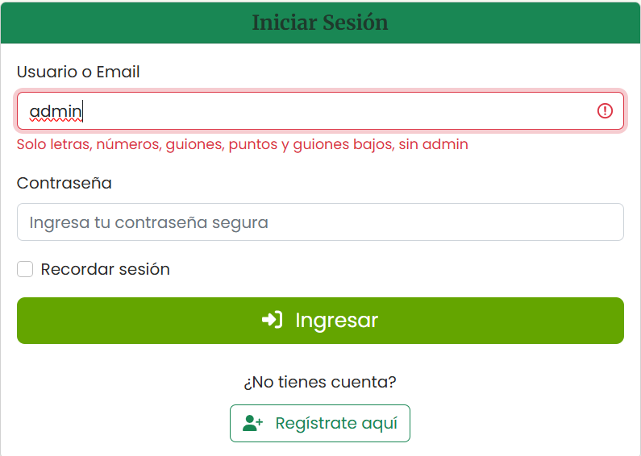
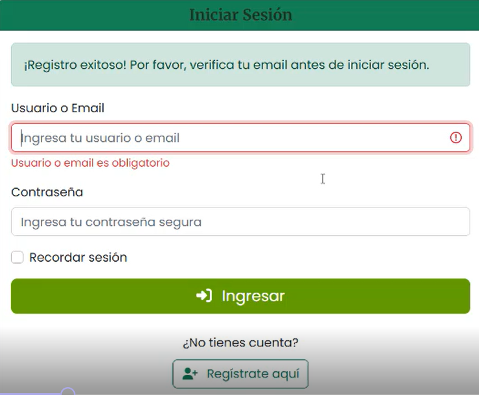
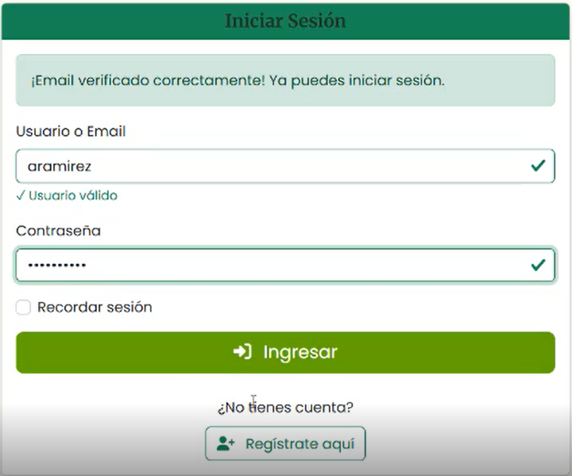
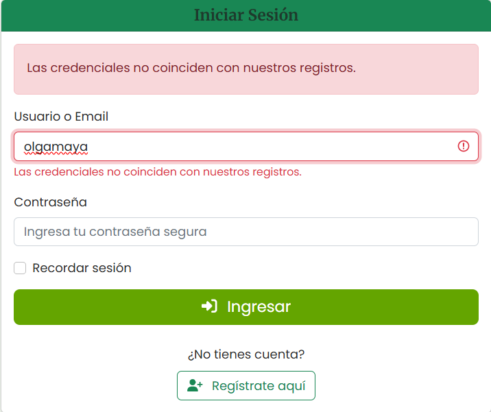
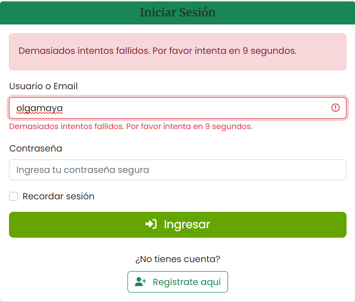

# DOCUMENTO DE SEGURIDAD
## TRABAJO FINAL: AUDITORÍA Y PRESENTACIÓN DE UN PROYECTO CON POLÍTICAS DE SEGURIDAD EN EL CÓDIGO
#### PROYECTO: SISTEMA DE FERTIRRIGACIÓN AUTOMATIZADA Y COMERCIO DIGITAL DE CULTIVO DE LECHUGA EN LA LOCALIDAD DE PIRHUAS – SIPE SIPE

## 1. Riesgos Identificados y Medidas de Mitigación
Se identificaron los riesgos, con base en los pilares fundamentales de la seguridad: Confidencialidad, integridad, disponibilidad y autenticación.

| Riesgo | Descripción | Medidas de Mitigación |
|--------|-------------|-----------------------|
|**Compromiso de credenciales**|Posible acceso no autorizado debido a la divulgación o exposición de credenciales.|- Garantizar que las contraseñas no se almacenen en texto plano mediante la instrucción `Hash::check($credentials['password'], $user->password)`.<br> - implementar autenticación multifactor (MFA).<br> - Forzar el cambio periódico de contraseñas y establecer políticas de complejidad.<br> - Monitorear y registrar accesos sospechosos.<br> - Capacitar al personal sobre buenas prácticas de seguridad y phishing.
|**Ataques de fijación de sesión** | Un atacante puede forzar a un usuario a usar un ID de sesión conocido y así tomar control de su sesión.| - Regenerar el ID de sesión al iniciar sesión o cambiar privilegios.<br> - Implementar expiración de sesiones y cierre automático tras inactividad.<br> - Usar cookies seguras con atributos HttpOnly y Secure. <br> - Monitorear accesos sospechosos y bloquear intentos de fijación de sesión. 
|**Fuerza bruta** | Intentos repetidos de adivinanza de credenciales. | - Límite de intentos de inicio de sesión.  con el uso de las instrucciones: `RateLimiter::hit($this->throttleKey($request));`; `RateLimiter::tooManyAttempts($this->throttleKey($request), 5);`<br>- Bloqueo temporal de la cuenta.<br>- Registro de intentos fallidos para auditoría. |
| **XSS (Cross-Site Scripting)** | Inyección de scripts maliciosos en campos de texto. | - Sanitización y validación del input en frontend y backend.<br>- Uso de `Content-Security-Policy`.<br>- Escapado de salida en vistas. <br>`$request->validate([...])` <br>`if (isset($user->estado) && $user->estado !== 'activo') {throw ValidationException::withMessages([...]);}`;|
| **Robo de sesiones** | Secuestro del token de autenticación. | - Tokens JWT con expiración corta.<br>- Almacenamiento seguro en `HttpOnly Cookies` o `localStorage` cifrado.<br>- Regeneración de token tras login. |
| **SQL Injection** | Manipulación de consultas SQL. | - Uso de consultas preparadas.<br>- Validación estricta de datos.<br>- ORM seguro (ej. Sequelize, Eloquent). |
| **Transmisión insegura de datos** | Robo de credenciales en tránsito. | - Uso obligatorio de HTTPS.<br>- Cifrado TLS 1.2+.<br>- No enviar contraseñas en texto plano. |
| **Contraseñas débiles** | Uso de contraseñas fáciles de adivinar. | - Validación de fortaleza.<br>- Hash seguro con `bcrypt`.<br>- Recomendaciones de complejidad al usuario. |
## 2. Justificación de las Decisiones de Seguridad

### 2.1. Manejo Seguro de Contraseñas (Hashing)

```php
Hash::check($credentials['password'], $user->password)
```
Propósito: Garantizar que las contraseñas no se almacenen en texto plano. Si la base de datos es comprometida, un atacante no podrá obtener las contraseñas reales de los usuarios, protegiendo así la confidencialidad de sus credenciales.

### 2.2. Regeneración de la Sesión y Token CSRF

```php
$request->session()->regenerate();
$request->session()->regenerateToken();
```

Propósito: Prevenir ataques de fijación de sesión (session fixation). Al regenerar el ID de sesión después del login, se asegura que un atacante no pueda hacerse con una sesión válida previamente establecida, protegiendo así la confidencialidad de la sesión del usuario.

### 2.3. Protección Contra Fuerza Bruta (Rate Limiting)
```php
RateLimiter::hit($this->throttleKey($request));
RateLimiter::tooManyAttempts($this->throttleKey($request), 5)
```
*Propósito:* Limitar los intentos de login para proteger la confidencialidad de las cuentas. Un atacante no puede probar ilimitadamente combinaciones de contraseñas para adivinar credenciales válidas.

## 3. Otros Aspectos de Seguridad
Validación de Entrada (Sanitización)
```php
$request->validate([...]);
```
Propósito: Prevenir ataques de inyección (como SQL Injection). Si un atacante puede inyectar código, puede extraer información confidencial de la base de datos. La validación y sanitización son la primera línea de defensa.

Verificación del Estado del Usuario
```php
if (isset($user->estado) && $user->estado !== 'activo') {
    throw ValidationException::withMessages([...]);
}
```
Propósito: Asegurar que el sistema funciona con datos correctos y proteger la confidencialidad. Una cuenta desactivada podría haber sido comprometida, y este control evita que sea usada para acceder a información sensible.

Configuración de Sesión (config/session.php)
Duración de Sesión
Óptimo: 4 horas para el caso de fertirriego

Configuraciones de Seguridad
```php
'expire_on_close' => true,    // Cerrar sesión al cerrar el navegador
'secure' => true,             // Solo HTTPS en producción
'http_only' => true,          // Prevenir acceso via JavaScript
```
## 4. Evidencias del trabajo realizado:
```php
......
[2025-08-28 16:00:53] Redireccionamiento según el rol del usuario:administrador
[2025-08-28 16:02:24] Inicio de sesión exitoso. Usuario:azamorano, usuario: agricultor
[2025-08-28 16:02:24] Redireccionamiento según el rol del usuario:agricultor
[2025-08-28 19:14:12] Inicio de sesión exitoso. Usuario:cvargas, usuario: comprador
[2025-08-28 19:14:12] Redireccionamiento según el rol del usuario:comprador
[2025-08-28 19:42:11] Inicio de sesión exitoso. Usuario:rvargas, usuario: comprador
[2025-08-28 19:42:11] Redireccionamiento según el rol del usuario:comprador
[2025-08-28 19:49:04] Inicio de sesión exitoso. Usuario:rvargas, usuario: comprador
[2025-08-28 19:49:04] Redireccionamiento según el rol del usuario:comprador
[2025-08-28 21:47:25] Inicio de sesión exitoso. Usuario:pvargas, usuario: comprador
[2025-08-28 21:47:25] Redireccionamiento según el rol del usuario:comprador
[2025-08-29 03:24:32] Inicio de sesión exitoso. Usuario:olgamaya, usuario: administrador
[2025-08-29 03:24:32] Redireccionamiento según el rol del usuario:administrador
[2025-08-29 03:25:54] Inicio de sesión exitoso. Usuario:azamorano, usuario: agricultor
[2025-08-29 03:25:54] Redireccionamiento según el rol del usuario:agricultor
[2025-08-29 03:27:29] Inicio de sesión exitoso. Usuario:rvargas, usuario: comprador
[2025-08-29 03:27:29] Redireccionamiento según el rol del usuario:comprador
[2025-08-29 03:32:38] Inicio de sesión exitoso. Usuario:aramirez, usuario: comprador
[2025-08-29 03:32:38] Redireccionamiento según el rol del usuario:comprador
......
```
| Validación Front-End: Registro             | Registro de Usuarios              | Bienvenida              |
|--------------------------------|--------------------------------|---------------------------------|
|  |  |  |

| Validación Back-End: Registro             |              |               |
|--------------------------------|--------------------------------|---------------------------------|
|  |  |

| Validación Back-End: Inicio de Sesión             |              |               |
|--------------------------------|--------------------------------|---------------------------------|
|  |  |

## 5. Consideraciones Finales
### Revisión de seguridad en todas las capas: Cliente y servidor
Si bien Laravel sigue el patrón MVC (Modelo-Vista-Controlador), su seguridad va mucho más allá de esta estructura arquitectónica. El framework incorpora múltiples capas de protección integradas:

#### Mecanismos de Seguridad Esenciales en Laravel:
1. Protección contra CSRF (Cross-Site Request Forgery)

    Tokens CSRF automáticos en formularios
    Verificación mediante middleware incluido en el grupo 'web'

2. Prevención de Inyección SQL

    Uso de Eloquent ORM y Query Builder con parámetros escapados
    Protección automática contra inyecciones SQL

3. Validación de Datos

    Sistema de validación robusto con reglas predefinidas
    Validación automática de tipos de datos y formatos

4. Autenticación Segura

    Hash de contraseñas con bcrypt por defecto
    Sistema de autenticación completo con scaffolding

5. Middleware de Seguridad

    Autenticación: auth, auth.basic
    Autorización: políticas y gates
    Protección: throttle para limitar peticiones

6. Protección XSS (Cross-Site Scripting)

    Escapado automático de variables en Blade ({{ }})
    Purificación de datos con clases específicas